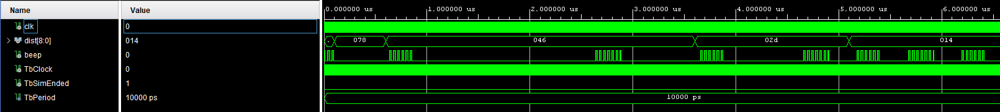

# Topic 4: Ultrasound sensor(s) controller (HS-SR04)
Členové týmu

1. Martin Čontoš (zodpovědný za )
2. Tadeáš Fojtách (zodpovědný za )
3. Pavel Horský (zodpovědný za )
4. Karel Matoušek (zodpovědný za )

## Abstract

## Demonstrační video

## Popis hardwaru

## Popis Softwaru

## Simulace

### LEDs

### 7-segment

### Bzučák

## Reference

Výstupy
  - 7-seg
  - bzučák
  - LEDky/RGB

Main - senzor

Top level
--------------------------------------
7-seg
  - 3 segmentovky na vzdálenost
  - 1 na zobrazení aktivních senzorů

Bzučák
  - od 1 metru
  - po 0,2 m zvyšovat frekvenci?

