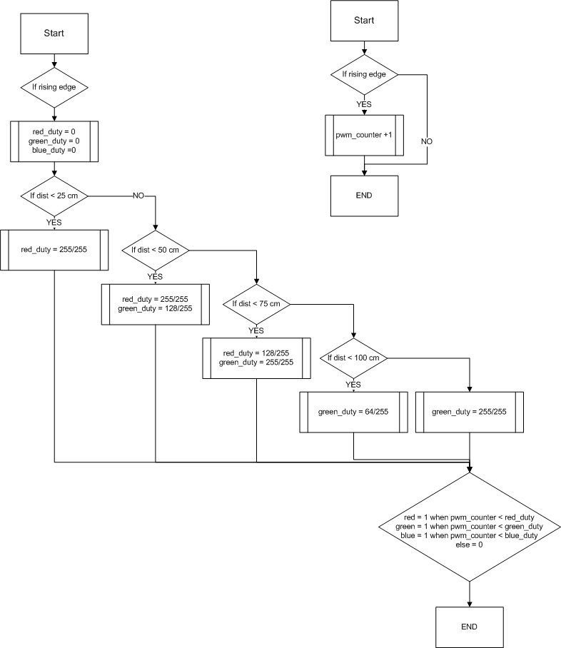

# Topic 4: Ultrasound sensor(s) controller (HS-SR04)
Členové týmu

1. Martin Čontoš (zodpovědný za RGB LEDs)
2. Tadeáš Fojtách (zodpovědný za display)
3. Pavel Horský (zodpovědný za buzzer)
4. Karel Matoušek (zodpovědný za ultrasonic sensor)

## Abstrakt

V tomto projektu jsme se zabývali naprogramováním FPGA desky Nexys A7-50T v programu Vivado v jazyce VHDL. Naše zařízení mělo za cíl měřit vzdálenost do čtyř směrů a tyto hodnoty předat uživateli. Pro vizualizaci jsme se rozhodli vypsat na sedmisegmentovém displeji hodnotu minimální vzdálenosti a zobrazit jaký sensor je nejblíže překážce. Navíc, pro rychlejší upozornění uživatele se mění barva na RGB LED od zelené k červené a bzučák vydává častější a častější pípání, tak jak to bývá v autech.

## Kompletní zapojení modulů s deskou

## Demonstrační video

Krátká ukázka funkčnosti zařízení\
https://www.youtube.com/watch?v=OFte7NRmbUw

## Popis použitého hardwaru
### Nexys A7-50T
Nexys A7-50T je multifunkční FPGA deska

| Č. | Komponenta               | Č. | Komponenta                    | Č. | Komponenta                    |
|----|--------------------------|----|-------------------------------|----|-------------------------------|
| 1  | Napájecí konektor        | 11 | Reset FPGA konfigurace        | 21 | 7-segmentový displej (8 číslic) |
| 2  | Napájecí spínač          | 12 | CPU reset                     | 22 | Mikrofon                      |
| 3  | USB host konektor        | 13 | Pět tlačítek                  | 23 | Jumper (SD / USB)             |
| 4  | PIC24 port (výroba)      | 14 | Pmod porty                    | 24 | MicroSD slot                  |
| 5  | Ethernet konektor        | 15 | Teplotní senzor               | 25 | UART/JTAG USB port            |
| 6  | LED – programování FPGA dokončeno | 16 | JTAG port                     | 26 | Jumper napájení a baterie     |
| 7  | VGA konektor             | 17 | RGB LED                       | 27 | LED napájení                |
| 8  | Audio konektor           | 18 | Posuvné přepínače (16x)     | 28 | Xilinx Artix-7 FPGA           |
| 9  | Jumper program. režimu   | 19 | LED diody (16x)             | 29 | DDR2 paměť                    |
| 10 | Analogový Pmod port      | 20 | Testovací body napájení napájení       |    |                               |

### HC-SR04

Ultrazvukový měřič vzdálenosti v rozsahu 20 mm až 4 m.

HC-SR04 je ovládán 10 us dlouhým spouštěcím impulzem, na který modul vyšle 8 zvukových impulzů a přepne výstup Echo do HI dokud nedostane odezvu, případně po překročení maximální vzdálenosti.

### Buzzer HW 508
HW 508 je modul řízený PWM signálem.

### Level Shifter
Modul umožňující převod logické úrovně mezi 3,3V a 5V logikou

## Propojení s moduly

## Popis Softwaru a simulace

### Main

#### Vstupy

      clk    : in STD_LOGIC;  -- Hodinový signál
      echo1  : in STD_LOGIC;  -- signál přijímaný ze senzoru 1
      echo2  : in STD_LOGIC;  -- signál přijímaný ze senzoru 2
      echo3  : in STD_LOGIC;  -- signál přijímaný ze senzoru 3
      echo4  : in STD_LOGIC;  -- signál přijímaný ze senzoru 4

#### Výstupy

      trig1  : out STD_LOGIC; -- signál pro ovládání senzoru 1
      trig2  : out STD_LOGIC; -- signál pro ovládání senzoru 2
      trig3  : out STD_LOGIC; -- signál pro ovládání senzoru 3
      trig4  : out STD_LOGIC; -- signál pro ovládání senzoru 4

      count1 : out STD_LOGIC_VECTOR(n_bits downto 0); -- čas aktivního signálu echo1 v us
      count2 : out STD_LOGIC_VECTOR(n_bits downto 0); -- čas aktivního signálu echo1 v us
      count3 : out STD_LOGIC_VECTOR(n_bits downto 0); -- čas aktivního signálu echo1 v us
      count4 : out STD_LOGIC_VECTOR(n_bits downto 0); -- čas aktivního signálu echo1 v us

#### Popis funkce
Tento source file ovládá ultrazvukové senzory a přijímá jejich výstup pro další zpracování. Každých 60 ms vyšle krátký 10 mikrosekundový impuls na výstupy trig1 - trig4. Aktivací senzoru se na vstupech echo1 - echo4 objeví logická 1, na tak dlouho, dokud senzor nezaznamená odražený signál. Tato doba se měří pomocí hodinového signálu a po jejím skončení se její hodnota ukládá na výstupy count1 - count4.

#### Simulace
Simulace reakce programu na délku impulzu na vstupy echo1 - echo4:

Simulace generování impulzů na výstupy trig1 - trig4:

### Vývojový diagram

Odkazy:\
Source code:\
https://github.com/Pavel025/De1-project/blob/branch_main/car_parking_sensors/car_parking_sensors.srcs/sources_1/new/main.vhd \
Testbench:\
https://github.com/Pavel025/De1-project/blob/branch_main/car_parking_sensors/car_parking_sensors.srcs/sim_1/new/main_tb.vhd

### LEDs

názorně a logicky svítí barvou, která reprezentuje naši vzdálenost od překážky

když jsme blízko (tzn. 0cm - 25cm svítí červeně)

po 25cm dostupech se odstín zabarvuje do zelena a od 1m svítí čistě zeleně = překážka je dost daleko 

Vstupy

    - clk     : in  STD_LOGIC;   -- Hodinový signál (100 MHz)
    - my_dist : in  STD_LOGIC_VECTOR(8 downto 0);  -- Vzdálenost v cm (9 bitů)

    

Výstupy

    - red     : out STD_LOGIC; 
    - green   : out STD_LOGIC;
    - blue    : out STD_LOGIC

Pomocné signály

      signal pwm_counter : unsigned(7 downto 0) := (others => '0');
Signály pro duty cycle (intenzita) každého kanálu

      signal red_duty   : unsigned(7 downto 0) := (others => '0');
      signal green_duty : unsigned(7 downto 0) := (others => '0');
      signal blue_duty  : unsigned(7 downto 0) := (others => '0');
  
  -- PWM counter je 8 bitové číslo, počítá od 0 do 255, + 1 se přidá s další rising edge clk 
  -- Frekvence PWM = 100 MHz / 256 = 390 kHz
  
    if rising_edge(clk) then
      pwm_counter <= pwm_counter + 1; -- Inkrementace čítače (0-255)
    end if;
  
  RGB led tedy bliká 390 tisíckrát během sekundy, je to více něž dost na to, aby jsme blikání okem nezaznamenali

  
  Upravuji PWM šířku, kde nastavuji číslo od 0 do 255, = Duty cycle

Vývojový diagram

Simulace 

RGB na desce 

### Bzučák
Pro zvukové upozornění slouží bzučák s proměnnou délkou pípání a mezery v závislosti na minimální vzdálenosti překážky

Vstupy
  -  clk   : in  std_logic;   -- clock (100 MHz)
  -  dist  : in  STD_LOGIC_VECTOR(8 downto 0);  -- vzdálenost v cm       
  

Výstupy
  -  beep  : out STD_LOGIC
    

Pomocné signály

  - constant CLK_FREQ : integer := 100_000_000; --délka 1s

  -  signal dist_internal  : unsigned(8 downto 0); -- vnitřní proměnná pro dist
  -  signal interval       : integer := 0;  -- ON + OFF
  -  signal beep_duration  : integer := 0;  -- ON
  -  signal counter        : integer := 0;  -- čítač interval
  -  signal beep_state     : std_logic := '0'; -- logická proměnná pro zápis do výstupu beep
  -  signal counter_beep   : integer := 0;  -- čítač beep_duration
  -  signal freg           : integer := 11364;  -- frekvence bzučáku cca 4400 Hz

Na následujícím obrázku je možné vidět vývojový diagram programu

Simulace funkčnosti:

Umístění bzučáku v zapojení:

Odkazy:\
Source code:\
https://github.com/Pavel025/De1-project/blob/Beep/car_parking_sensors/car_parking_sensors.srcs/sources_1/new/Buzzer.vhd \
Testbench:\
https://github.com/Pavel025/De1-project/blob/Beep/car_parking_sensors/car_parking_sensors.srcs/sim_1/new/tb_Buzzer.vhd

### 7-segment

### Top level

#### Vstupy
    CLK100MHZ : in STD_LOGIC;
    ECHO1     : in STD_LOGIC;
    ECHO2     : in STD_LOGIC;
    ECHO3     : in STD_LOGIC;
    ECHO4     : in STD_LOGIC;

#### Výstupy
    TRIG1     : out STD_LOGIC;
    TRIG2     : out STD_LOGIC;
    TRIG3     : out STD_LOGIC;
    TRIG4     : out STD_LOGIC;
    
    BUZZER    : out STD_LOGIC;
    
    LED_R     : out STD_LOGIC;
    LED_G     : out STD_LOGIC;
    LED_B     : out STD_LOGIC;
    
    CA        : out   std_logic;                     
    CB        : out   std_logic;                     
    CC        : out   std_logic;                     
    CD        : out   std_logic;                     
    CE        : out   std_logic;                     
    CF        : out   std_logic;                     
    CG        : out   std_logic;                     
    DP        : out   std_logic;                     
    AN        : out   std_logic_vector(7 downto 0)

#### Popis funkce
Top level propojuje všechny ostatní části programu

#### Schéma

## Reference
https://digilent.com/reference/programmable-logic/nexys-a7/reference-manual?srsltid=AfmBOoqcXasRu5ogYykyAvmd7k7G_U6G6f-TFImJu0mmkMR8xbL4xAxm

https://images.theengineeringprojects.com/image/webp/2018/10/Introduction-to-HC-SR04.jpg.webp?ssl=1

https://www.farnell.com/datasheets/3422740.pdf

https://microcontrollerslab.com/buzzer-module-interfacing-arduino-sound-code/

https://robu.in/wp-content/uploads/2016/05/i2c-logic-level-converter-4-channel-bi-directional-module.pdf

https://vhdl.lapinoo.net/

