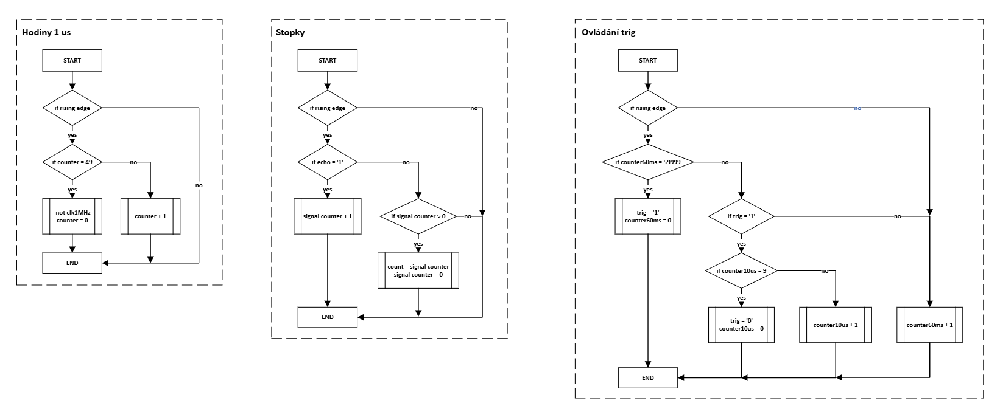

## Main

### Vstupy

      clk    : in STD_LOGIC;  -- Hodinový signál
      echo1  : in STD_LOGIC;  -- signál přijímaný ze senzoru 1
      echo2  : in STD_LOGIC;  -- signál přijímaný ze senzoru 2
      echo3  : in STD_LOGIC;  -- signál přijímaný ze senzoru 3
      echo4  : in STD_LOGIC;  -- signál přijímaný ze senzoru 4

### Výstupy

      trig1  : out STD_LOGIC; -- signál pro ovládání senzoru 1
      trig2  : out STD_LOGIC; -- signál pro ovládání senzoru 2
      trig3  : out STD_LOGIC; -- signál pro ovládání senzoru 3
      trig4  : out STD_LOGIC; -- signál pro ovládání senzoru 4

      count1 : out STD_LOGIC_VECTOR(n_bits downto 0); -- čas aktivního signálu echo1 v us
      count2 : out STD_LOGIC_VECTOR(n_bits downto 0); -- čas aktivního signálu echo1 v us
      count3 : out STD_LOGIC_VECTOR(n_bits downto 0); -- čas aktivního signálu echo1 v us
      count4 : out STD_LOGIC_VECTOR(n_bits downto 0); -- čas aktivního signálu echo1 v us

### Popis funkce
Tento source file ovládá ultrazvukové senzory a přijímá jejich výstup pro další zpracování. Každých 60 ms vyšle krátký 10 mikrosekundový impuls na výstupy trig1 - trig4. Aktivací senzoru se na vstupech echo1 - echo4 objeví logická 1, na tak dlouho, dokud senzor nezaznamená odražený signál. Tato doba se měří pomocí hodinového signálu a po jejím skončení se její hodnota ukládá na výstupy count1 - count4.

### Simulace
Simulace reakce programu na délku impulzu na vstupy echo1 - echo4:

Simulace generování impulzů na výstupy trig1 - trig4:

### Vývojový diagram

## Top level

### Vstupy
    CLK100MHZ : in STD_LOGIC;
    ECHO1     : in STD_LOGIC;
    ECHO2     : in STD_LOGIC;
    ECHO3     : in STD_LOGIC;
    ECHO4     : in STD_LOGIC;

### Výstupy
    TRIG1     : out STD_LOGIC;
    TRIG2     : out STD_LOGIC;
    TRIG3     : out STD_LOGIC;
    TRIG4     : out STD_LOGIC;
    
    BUZZER    : out STD_LOGIC;
    
    LED_R     : out STD_LOGIC;
    LED_G     : out STD_LOGIC;
    LED_B     : out STD_LOGIC;
    
    CA        : out   std_logic;                     
    CB        : out   std_logic;                     
    CC        : out   std_logic;                     
    CD        : out   std_logic;                     
    CE        : out   std_logic;                     
    CF        : out   std_logic;                     
    CG        : out   std_logic;                     
    DP        : out   std_logic;                     
    AN        : out   std_logic_vector(7 downto 0)

### Popis funkce
Top level propojuje všechny ostatní části programu

### Schéma
